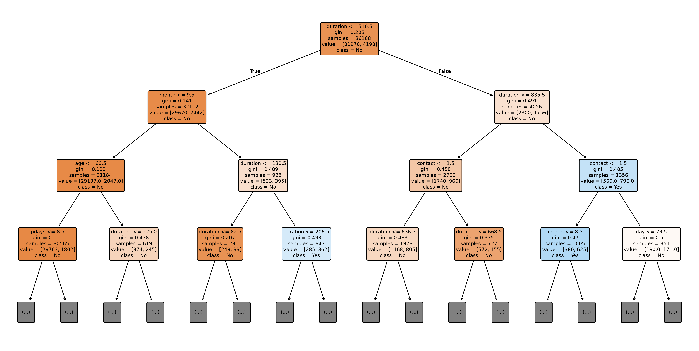

# 🌳 SkillCraft Technology - Data Science Internship

# Task 3: Decision Tree Classifier for Customer Purchase Prediction

## 🎯 Objective

The objective of this project is to build a **Decision Tree Classifier** that predicts whether a customer will purchase a product or service based on demographic and behavioral data. The project demonstrates the complete machine learning workflow, including data inspection, preprocessing, model building, evaluation, feature importance analysis, and decision tree visualization.

---
## 📂 Dataset

- **Dataset:** Bank Marketing Dataset
- **Source:** UCI Machine Learning Repository

The Bank Marketing Dataset contains customer demographic and behavioral information that is used to build and evaluate a Decision Tree Classifier for the customer purchase prediction task.

---

## 🛠️ Technologies Used

- Python
- Pandas
- NumPy
- Matplotlib
- Scikit-learn
- Jupyter Notebook

---

## 📁 Project Structure

```
SCT_DS_3/
│── data/
│   └── bank-full.csv
│
├── images/
│   └── decision_tree.png
│
├── notebooks/
│   └── task3.ipynb
│
├── README.md
├── requirements.txt
└── .gitignore
```

---

## 📊 Project Workflow

### 1. Dataset Inspection

- Loaded the dataset
- Examined dataset dimensions
- Checked column names
- Verified data types
- Checked missing values
- Generated descriptive statistics

### 2. Data Preprocessing

- Checked duplicate records
- Verified missing values
- Encoded categorical features using Label Encoding
- Split features and target variable
- Performed Train-Test Split

### 3. Model Building

- Built a Decision Tree Classifier
- Trained the model
- Generated predictions on the test dataset

### 4. Model Evaluation

- Accuracy Score
- Confusion Matrix
- Classification Report
- Feature Importance Analysis

### 5. Decision Tree Visualization

- Visualized the trained Decision Tree
- Saved the visualization in the **images** folder

### 6. Insights & Conclusion

- Analyzed model performance
- Identified important predictive features
- Summarized key findings

---

## 📈 Model Performance

| Metric | Value |
|---------|--------|
| Accuracy | **87.40%** |

The Decision Tree Classifier achieved good overall performance while providing an interpretable model for understanding the factors influencing predictions.

---

## 📷 Decision Tree Visualization



---

## 🔍 Key Insights

- The Decision Tree Classifier achieved an accuracy of approximately **87.4%**.
- The model demonstrated strong overall classification performance.
- Features such as **Duration**, **Balance**, **Age**, and **Month** contributed significantly to the model's predictions.
- Feature importance analysis helped identify the most influential variables.
- Decision Trees provide an interpretable approach for solving classification problems.

---

## ✅ Conclusion

This project successfully demonstrates the development of a Decision Tree Classifier for customer purchase prediction using demographic and behavioral data. The complete machine learning pipeline—including data inspection, preprocessing, model training, evaluation, feature importance analysis, and decision tree visualization—was implemented successfully. The resulting model achieved good predictive performance while remaining easy to interpret, making Decision Trees an effective choice for this classification task.

---

## 🚀 How to Run

### Clone the repository

```bash
git clone https://github.com/varun99638/SCT_DS_3.git
```

### Install the required libraries

```bash
pip install -r requirements.txt
```

### Launch Jupyter Notebook

```bash
jupyter notebook notebooks/task3.ipynb
```

---

## 📋 Requirements

All required Python libraries are listed in the **requirements.txt** file.

---

## 📚 References

- UCI Machine Learning Repository – Bank Marketing Dataset
- Scikit-learn Documentation
- Pandas Documentation
- Matplotlib Documentation

---

## 👨‍💻 Author

**Saivarun**

- GitHub: https://github.com/varun99638